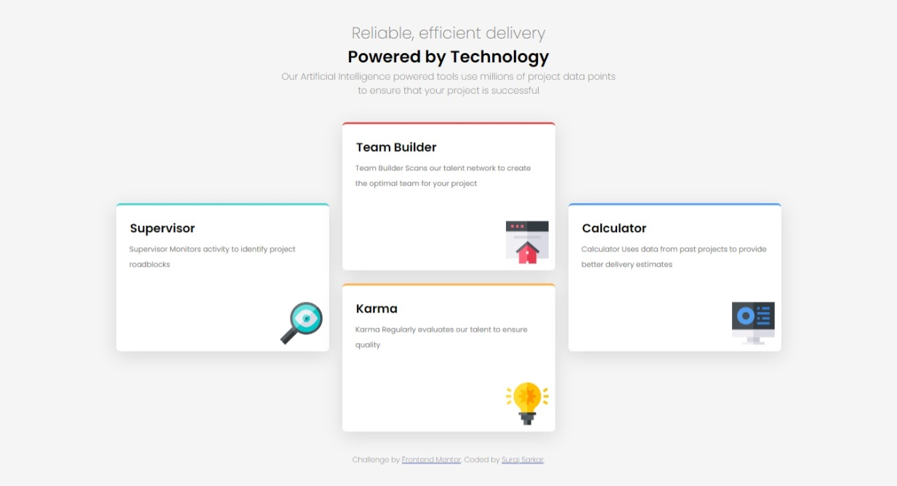
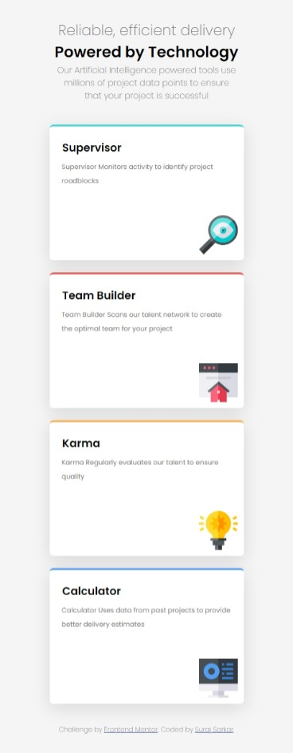
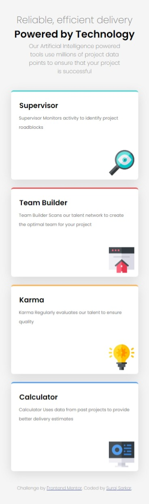

# Frontend Mentor - Four card feature section solution

This is a solution to the [Four card feature section challenge on Frontend Mentor](https://www.frontendmentor.io/challenges/four-card-feature-section-weK1eFYK). Frontend Mentor challenges help you improve your coding skills by building realistic projects. 

## Table of contents

- [Overview](#overview)
  - [The challenge](#the-challenge)
  - [Screenshot](#screenshot)
  - [Links](#links)
- [My process](#my-process)
  - [Built with](#built-with)

- [Author](#author)


## Overview

### The challenge

Users should be able to:

- View the optimal layout for the site depending on their device's screen size

### Screenshot

#### Desktop Version



#### Mobile Version






### Links

- Solution URL: [Add solution URL here](https://your-solution-url.com)
- Live Site URL: [Add live site URL here](https://your-live-site-url.com)

## My process

### Built with

- [Semantic HTML5 markup](https://www.bitdegree.org/learn/html5-semantic-tags)
- [Flexbox](https://developer.mozilla.org/en-US/docs/Web/CSS/CSS_Flexible_Box_Layout/Basic_Concepts_of_Flexbox)
- [CSS Grid](https://developer.mozilla.org/en-US/docs/Web/CSS/CSS_Grid_Layout)
- [Mobile-first workflow](https://developer.mozilla.org/en-US/docs/Web/CSS/@media)


To see how you can add code snippets, see below:

```css
.flex_container {
  display: flex;
  flex-direction: row;
  align-items: center; /*centers items horizontally*/
  justify-content: center; /*centers item vertically*/
}
```
```css
.feature{
  box-shadow: rgba(100, 100, 111, 0.2) 0px 7px 29px 0px; /*creates shadow under the feature boxes*/
}
```

## Author

- Website - [Suraj Sarkar](https://www.your-site.com)
- Frontend Mentor - [@surajsarkar](https://www.frontendmentor.io/profile/surajsarkar)
